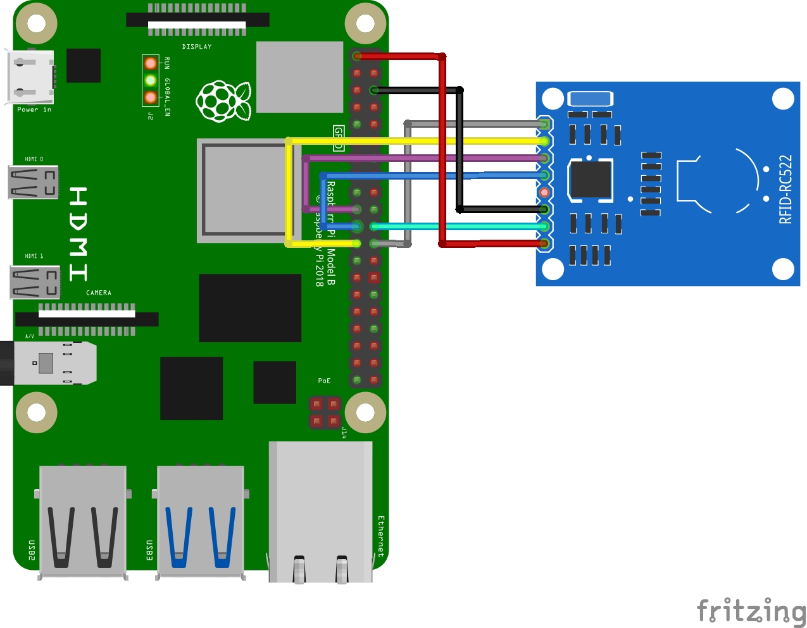

# Kidsquad Raspberry Pi RFID Reader Setup

## Introduction

This zip file/folder has `index.html`,`Read.py`,`readme.md`,`rfid-image-2.jpg`,`rfid-rc522-raspberry-pi-wiring-diagram.webp`,`main.py` and `Write.py`.

`index.html` will be a webpage that one will be opening when the program is running to interact with the RFID system. This is still a work in progress.

`Read.py` is the test file for reading the RFID tag

`readme.md` has the step-by-step instructions on how to get started with setting up your pi to run the RFID scripts in the folder

`rfid-image-2.jpg` and `rfid-rc522-raspberry-pi-wiring-diagram.webp` have images showing you how to wire the RC 522 RFID sensor to the Pi

`main.py` is the main file for running the program.. This is still a work in progress.

`Write.py` is the test file for writing data to the RFID tag

## Equipment List

- Raspberry Pi
- RC522 RFID Reader
- Dupont female to female cables
- Internet connection (WiFi/Ethernet)

## Assembling the RFID RC522

Ensure pins are soldered onto the board. If you are not able to solder the pins, talk to the nearest radio/electricals repair man and they should be able to do it for you. It is a cheap process. Shouldn't be more than $1.

## Wiring the RFID RC522 to the Pi

> **_Please do the wiring below with the raspberry pi disconnected from the power_**

On your RFID RC522 you will notice that there are 8 possible connections on it, these being SDA (Serial Data Signal), SCK (Serial Clock), MOSI (Master Out Slave In), MISO (Master In Slave Out), IRQ (Interrupt Request), GND (Ground Power), RST (Reset-Circuit) and 3.3v (3.3v Power In). We will need to wire all of these but the IRQ to our Raspberry Pi’s GPIO pins as shown below

- SDA connects to Pin 24.
- SCK connects to Pin 23.
- MOSI connects to Pin 19.
- MISO connects to Pin 21.
- GND connects to Pin 6.
- RST connects to Pin 22.
- 3.3v connects to Pin 1.

[Sample image showing how to wire the rfid module to raspberry pi](rfid-rc522-raspberry-pi-wiring-diagram.webp)


[Video showing how to connect and setup the pi](https://youtu.be/evRuZRxvPFI?si=4u77HZNdNK_3R49Z)

## Setting up Pi OS for the RFID RC522

Follow the steps below to configure your Raspberry Pi and Raspberry Pi OS to utilize the SPI interface that is needed to communicate with the Pi.

1. Let’s begin by first opening the raspi-config tool, and we can do this by opening the terminal and running the following command.

```
sudo raspi-config
```

2. This tool will load up a screen showing a variety of different options. On here use the arrow keys to select `5 Interfacing Options`. Once you have this option selected, press Enter.

3. Now on this next screen, you want to use your arrow keys to select `P4 SPI`, again press Enter to select the option once it is highlighted.

4. You will now be asked if you want to enable the SPI Interface, select `Yes` with your arrow keys and press Enter to proceed. You will need to wait a little bit while the raspi-config tool does its thing in enabling SPI.

5. Once the SPI interface has been successfully enabled by the raspi-config tool you should see the following text appear on the screen, `The SPI interface is enabled`.

- Before the SPI Interface is fully enabled we will first have to restart the Raspberry Pi. To do this first get back to the terminal by pressing `Enter` and then `ESC`.
- Type the following Linux command into the terminal on your Raspberry Pi to restart your Raspberry Pi.

```
sudo reboot
```

6. Once your Raspberry Pi has finished rebooting, we can now check to make sure that it has in fact been enabled. The easiest way to do this is to run the following command to see if `spi_bcm2835` is listed.

```
lsmod | grep spi
```

- If you see `spi_bcm2835`, then you can proceed and skip on to the next section. If for some reason it had not appeared when you entered the previous command, try following the next three steps.

7. If for some reason the SPI module has not activated, we can edit the boot configuration file manually by running the following command on our Raspberry Pi.

```
sudo nano /boot/config.txt
```

8. Within the configuration file, use `CTRL` + `W` to find `dtparam=spi=on`.

- If you have found it, check to see if there is a `#` in front of it. If there is, remove it as this is commenting out the activation line. If you can’t find the line at all, add `dtparam=spi=on` to the bottom of the file.
- Once you have made the changes, you can press `CTRL` + `X` then pressing `Y` and then `Enter` to save the changes.
- You can now proceed from Step 5 again, rebooting your Raspberry Pi then checking to see if the module has been enabled.

## Installing the Required Packages

1. Run the following two commands on your Raspberry Pi to update it and ensure it is running the latest version of all the software.

```
sudo apt update
sudo apt upgrade
```

2. Then run the following command on your Raspberry Pi to install all of the required packages needed for the scripts

```
sudo apt install python3-dev python3-pip python3-venv
```

## Creating a Virtual Environment

Before running any command, ensure you are in the right directory. (This is after unzippping the zip file)

```
cd ~/tag_system_pi
```

3. We now create a virtual environment to run our scripts in by running the command below

```
python3 -m venv env
```

4. Once this is done, use the command below to start utilizing it.

```
source env/bin/activate
```

- After running the above command, you should see your terminal line starts with `(env)`.

## Installing the Packages to Use RFID RC522 on the Pi

5. Run the following command to install spidev through pip. The spidev library helps handle interactions with the SPI.

```
python3 -m pip install spidev
```

6. Run the following command to install MFRC522 through pip. This library implements the RFID RC522 interface and it is what enables us to read and write data to the RFID Tags.

```
python3 -m pip install mfrc522
python3 -m pip install websockets
python3 -m pip install requests
```

## Running the scripts

Before running either script, ensure you are in the right directory, and you are using the virtual environment stored within it

```
cd ~/tag_system_pi
source env/bin/activate
```

### Write data to A Tag

1. Run the command below to run the program that writes data to a tag

```
python3 Write.py
```

2. You will be asked to write in the new data. Type in whatever you want written to the tag. Press `ENTER` when you are happy with what you have written.

3. With that done, simply place your RFID Tag on top of your RFID RC522 circuit. As soon as it detects it, it will immediately write the new data to the tag. You should see `Written` appear in your command line if it was successful. You can look at an example output below to see what a successful run looks like.

```
pi@raspberrypi:~/tag_system_pi $ sudo python3 Write.py
New data:Edward Omondi
Now place your tag to write
Written
```

### Read data from A Tag

1. Run the command below to run the program that reads data from a tag

```
python3 Read.py
```

2. With the script now running, all you need to do is place your RFID Tag on top of your RFID RC522 circuit. As soon as the RFID tag being placed on top is detected, it will immediately read the data and print it back out to you.
   An example of what a successful output would look like is displayed below.

```
pi@raspberrypi:~/tag_system_pi $ sudo python3 Read.py
287853608425
Edward Omondi
```

## Serving the UI

### nginx setup

The application runs on the browser so we first setup NGINX to serve it.
Run the commands below

```
sudo apt-get install nginx
sudo cp ~/tag_system_pi/* /var/www/html
sudo service nginx restart
cd ~/tag_system_pi
chmod +x start.sh
chmod +x stop.sh
./start.sh
```

All done!

To open the application, go to [http://[username].local](http://[username].local) in your browser. Replace `[username]` with the pi username

## Automatic starting when booted up

To have your script start up automatically every time the Raspberry Pi boots up, you can use systemd, which is a system and service manager for Linux. Here's how you can create a systemd service for your script:

1. Create a systemd service unit file for your script. You can do this by creating a new file ending with `.service` in the `/etc/systemd/system/` directory. For example:

```
sudo nano /etc/systemd/system/connect_scanner.service
```

2. Add the following content to the file:

```
[Unit]
Description=Connect to scanner on Boot
After=network.target

[Service]
ExecStart=/home/[username]/tag_system_pi/start.sh
WorkingDirectory=/home/[username]/tag_system_pi
StandardOutput=/home/[username]/tag_system_pi/connect_scanner.log
StandardError=/home/[username]/tag_system_pi/connect_scanner_error.log
Restart=always
User=[username]

[Install]
WantedBy=multi-user.target
```

Replace `username` with your username.

3. Save the file and exit the text editor. `Ctrl+X`, then `Y` then `Enter`.

4. Reload systemd to read the new service file:

```
sudo systemctl daemon-reload
```

5. Enable the service to start at boot:

```
sudo systemctl enable connect_scanner.service
```

6. Start the service:
>Create the output files first by running the commands below remembering to replace username with  your username
```
touch /home/[username]/tag_system_pi/connect_scanner.log
touch /home/[username]/tag_system_pi/connect_scanner_error.log
```
```
sudo systemctl start connect_scanner.service
```

Now, your script should start automatically every time the Raspberry Pi boots up. You can also manually start, stop, and check the status of the service using `systemctl`. For example:

- To stop the service: `sudo systemctl stop connect_scanner.service`
- To check the status of the service: `sudo systemctl status connect_scanner.service`
- To view the output: `tail -f /home/aims/tag_system_pi/connect_scanner.log`
